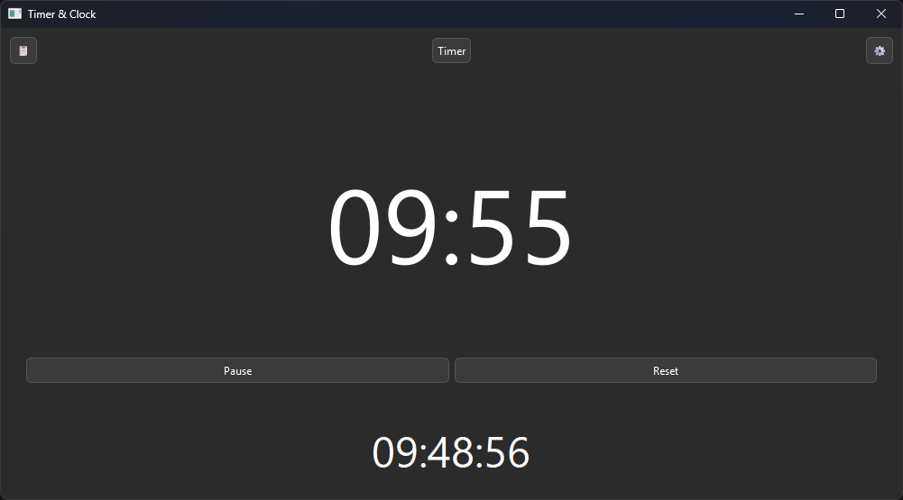

# Timer & Stopwatch App

A modern, minimalistic Timer and Stopwatch application built with PyQt6 for Windows (cross-platform compatible).


## ✨ Features

### 🕐 Dual Mode Operation
*   **Countdown Timer:** Set custom timers with quick presets or manual input
*   **Stopwatch:** Track elapsed time with lap functionality
*   Seamless switching between modes

### 🎨 User Interface
*   **Minimalistic Design:** Clean, distraction-free interface with large, easy-to-read numbers
*   **Responsive Layout:** Timer display automatically resizes with the window
*   **Smart Layout:** 80% dedicated to Timer/Stopwatch, 20% to real-time clock display
*   **Dark/Light Mode:** Toggle between themes for comfortable viewing in any environment

### ⏱️ Timer Features
*   Quick presets: 5m, 10m, 15m, 30m, 1h
*   Manual numeric input for custom durations
*   Pause/Resume functionality
*   Reset button
*   Audio notification when timer completes
*   System notifications upon completion



### ⏲️ Stopwatch Features
*   Start/Stop controls
*   Lap time tracking
*   Reset functionality
*   Precise time measurement


### ⚙️ Settings
*   Dark/Light mode toggle
*   12h/24h time format selection
*   Time Zone selection (or use System Time)
*   Persistent preferences

### 📊 History
*   Session-based logging of completed timers
*   Track your productivity throughout the day

## 🚀 Quick Start

### Requirements

*   Python 3.x
*   PyQt6
*   pytz
*   requests
*   plyer

### Installation

1. Clone the repository:
```bash
git clone https://github.com/paeterna/simple-timer-stopwatch-windows.git
cd simple-timer-stopwatch-windows
```

2. Install dependencies:
```bash
pip install PyQt6 pytz requests plyer
```

### Running the App

```bash
python main.py
```

## 📦 Building an Executable

To create a standalone executable:

```bash
build.bat
```

The executable will be generated in the `dist` folder.

## 🛠️ Technologies Used

*   **PyQt6** - GUI framework
*   **Python 3** - Core programming language
*   **pytz** - Timezone handling
*   **plyer** - Cross-platform notifications
*   **PyInstaller** - Executable packaging

## 📝 License

This project is licensed under the MIT License - see the [LICENSE](LICENSE) file for details.

## 🤝 Contributing

Contributions, issues, and feature requests are welcome!

## 👨‍💻 Author

**paeterna**
- GitHub: [@paeterna](https://github.com/paeterna)
